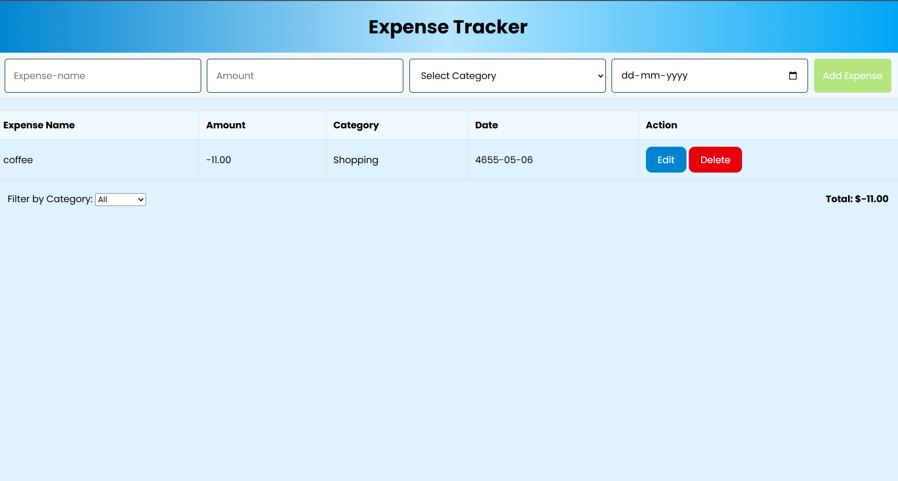

# 💸 Expense Tracker App

A simple and responsive Expense Tracker application built using **HTML**, **CSS**, and **JavaScript**. It helps users track their daily expenses with an intuitive interface and local storage support.

 

---

## 📌 Features

- 📥 Add new expenses with amount, description, and date  
- 🗂️ Display a list of added expenses  
- 🗑️ Delete individual expenses  
- 💾 Persistent data using **Local Storage**  
- 📱 Fully responsive design for mobile and desktop  

---

## 🛠️ Tech Stack

- **HTML5** – For the structure of the app  
- **CSS3** – For styling and layout  
- **JavaScript (ES6)** – For dynamic functionality and interactivity  
- **Local Storage** – To store expense data in the browser  

---

## 🚀 Live Demo

👉 [Live Demo Link]([https://your-live-demo-link.netlify.app](https://expense-tracker-app-04.netlify.app/))

---

## 📂 Project Structure
├── index.html # Main HTML file
├── style.css # Stylesheet for layout and design
└── script.js # JavaScript for app functionality


---

## 🧪 How to Use

1. **Clone the repository**

```bash
git clone https://github.com/DineshPabboju/Expense-Tracker-App.git
cd Expense-Tracker-App
```
2. **Open in Browser**

Simply open index.html in your browser.

💡 No need for a server or build tools — it's 100% static!

**🙌 Contributing**
Want to make this better? Contributions are welcome!

Fork the repo

Create a new branch (git checkout -b feature/YourFeature)

Commit your changes

Push and create a Pull Request

📄 License
This project is open source and available under the MIT License.
